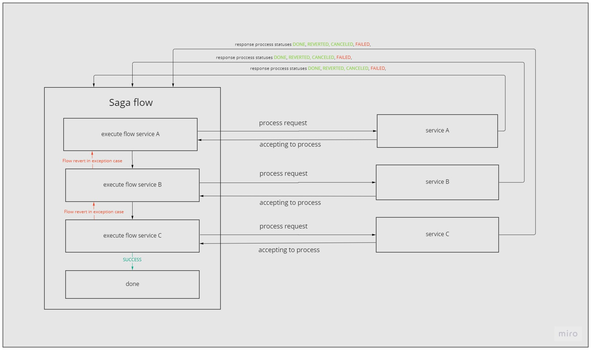

# Microservice application

This readme file describes the general concept and steps for starting the application locally.

## General concept

Whole process includes three steps. (service-a -> service-b -> service-c).
The Saga Orchestration pattern is used to manage flow.

You can see how it works on the image below.



## Steps to start the application locally

1. Clone sources from the GitHub repository:
````
git@github.com:Prof0Soft/micro-services-saga.git
````

2. Go to the project directory:
````
cd micro-services-saga
````
3. Run databases using docker compose:
````
docker-compose run
````

4. Build modules from source
````
mvn package <module src dir>
````

6. Run services step by step
````
java -jar <module jar filepath>
````

### The process looks like
````
orchestrator logs:
[nio-8080-exec-9] c.s.s.service.impl.OrderServiceImpl      : Start create order process
[nio-8080-exec-9] c.s.s.s.i.SagaOrchestratorServiceImpl    : Initiate saga service.
[nio-8080-exec-3] c.s.s.service.impl.OrderServiceImpl      : Cancel order for id c0a86430-80e1-12a7-8180-e11eadbe0004
[nio-8080-exec-3] c.s.s.s.i.SagaOrchestratorServiceImpl    : Run cancel process with task id c0a86430-80e1-12a7-8180-e11eadbe0004
[nio-8080-exec-2] c.s.s.s.i.SagaOrchestratorServiceImpl    : Run revert flow.

services logs:
[nio-8081-exec-1] c.s.order.service.impl.TaskServiceImpl   : Task c0a86430-80e1-12a7-8180-e11eadbe0004 created
[scheduling-1] c.s.o.service.impl.TaskSchedulerImpl        : Task c0a86430-80e1-12a7-8180-e11eadbe0004 is scheduled for execution
[scheduler-pool1] c.s.order.service.impl.TaskExecutorImpl  : Looking room for task with id: c0a86430-80e1-12a7-8180-e11eadbe0004
[scheduler-pool1] c.s.order.service.impl.TaskExecutorImpl  : Task processing...0%
[scheduler-pool1] c.s.order.service.impl.TaskExecutorImpl  : Task processing...10%
[scheduler-pool1] c.s.order.service.impl.TaskExecutorImpl  : Task processing...20%
[scheduler-pool1] c.s.order.service.impl.TaskExecutorImpl  : Task processing...30%
[scheduler-pool1] c.s.order.service.impl.TaskExecutorImpl  : Task processing...40%
[scheduler-pool1] c.s.order.service.impl.TaskExecutorImpl  : Task processing...50%
[scheduler-pool1] c.s.order.service.impl.TaskExecutorImpl  : Task processing...60%
[scheduler-pool1] c.s.order.service.impl.TaskExecutorImpl  : Task processing...70%
[scheduler-pool1] c.s.order.service.impl.TaskExecutorImpl  : Task processing...80%
[scheduler-pool1] c.s.order.service.impl.TaskExecutorImpl  : Task processing...90%
[scheduler-pool1] c.s.order.service.impl.TaskExecutorImpl  : Task was canceled.
[scheduler-pool1] c.s.o.s.impl.SagaClientServiceImpl       : send result to orchestrator, task id c0a86430-80e1-12a7-8180-e11eadbe0004
````
### Database

Database is initiated from docker compose which is located in the root folder in the project.
